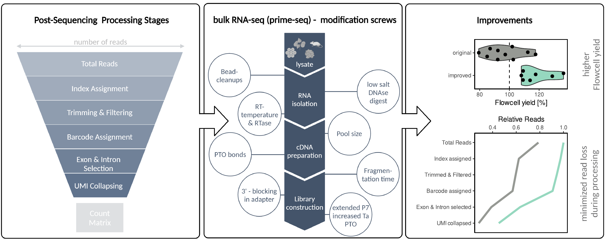

# prime-seq 2

This repository contains scripts used for the analysis performed in our manuscript

**Improving RNA-seq protocols**
*Felix Pförtner, Eva Briem, Wolfgang Enard, Daniel Richter*

For the full prime-seq protocol please visit [protocols.io](https://www.protocols.io/view/prime-seq-2-dsyx6fxn).

---

We introduce an approach to optimize bulk RNA-seq protocols by systematically minimizing read loss across processing steps while keeping sensitivity and complexity uncompromised. We applied this **"funnel strategy"** to prime-seq, addressing critical stages of the protocol—including DNA digestion, reverse transcription, adapter ligation, and amplification—to achieve notable efficiency enhancements. 

The optimized protocol increases final unique molecular identifiers (UMIs) by 60~\% at equal sequencing costs or, conversely, reduces sequencing costs by 38~\% at equal counts. This further improves one of the most cost-efficient bulk RNA-seq protocols available, creating **prime-seq 2**, and outlines strategies and mechanisms of potential relevance for other protocols amplifying complex nucleic acid samples for sequencing.

